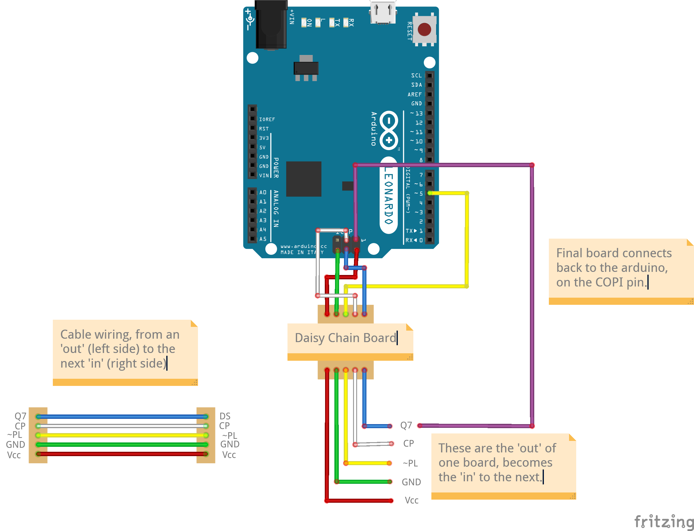

The Pit
=======

Simple arduino-based gamepad to connect custom switches and toggles and easily bind into DCS (uses standard mappings, nothing fancy).

Supports hundreds of switches on a single arduino board.

Relies on [HC165N Parallel-Load Shift Registers](https://www.ti.com/lit/ds/symlink/sn74hc165.pdf?ts=1660549874101), which are inexpensive ICs, to achieve a high number of inputs.

Firmware
--------

Arduino-based program to manage a Sim Pit efficiently.
The code is setup to be able to handle hundreds of inputs over a single Arduino chip, via the use of shift registers and [SPI](https://en.wikipedia.org/wiki/Serial_Peripheral_Interface).

The recommended and target board is [Leonardo](https://docs.arduino.cc/hardware/leonardo).

### Setup

* Download and install [Arduino IDE v2](https://www.arduino.cc/en/software)
* Copy the `firmware/hardware` folder to your local Arduino install, ie `%USERPROFILE%/Documents/Arduino/`.
  - In the end, you should have a `%USERPROFILE%/Documents/Arduino/hardware/thepit/avr/boards.txt` file.
  - You can verify it works if your Arduino can locate a `The Pit (Leonardo)` board.

### Uploading

Because the software is trying to maximize available inputs, it eats up the endpoints that are used to upload a sketch any time.
Reset the board during the `Upload...` phase, otherwise it will fail.

### Customizing

Customizable values, such as the number of daisy-chained hc165, how many gamepads we're emulating, etc, are available in `thepitconfig.user.h`.

Hardware
--------

### Daisy-chained hc165 Board

A simple board to easily daisy-chain several hc165 together.
Each board has 4 connectors:
* 1x daisy chain in, that you connect from the out of the previous board (or from the arduino board)
* 1x daisy chain out, that you connect to the in of the next board (or to the receiving end of the arduino board)
* 2x inputs, each with 4x inputs and 1x ground, that you connect to your switches (pull-up logic, integrated to the board).

### Wiring

Pin 5 is used to latch the hc165, use the ICSP pins for SPI communication.
On the board, the pins from the connector are labeled with their usage:
* Vcc: 5V in
* GND: Ground
* ~PL: Pulse Latch (Pin 5)
* CP: Clock Pulse (SCK, pin 3 on the ICSP)
* DS: Data Serial in (for daisy chain in) (COPI, pin 4 on the ICSP for the first in the chain)
* Q7: Data serial out (for daisy chain out) (CIPO, pin 1 on the ICSP for the last in the chain)

Licenses
--------

Firmware is released under the [Mozilla Public License 2.0](https://mozilla.org/MPL/2.0/)
Hardware designs are Open Hardware, [licensed under CERN-OHL-W v2 or later](https://ohwr.org/cern_ohl_w_v2.txt)
